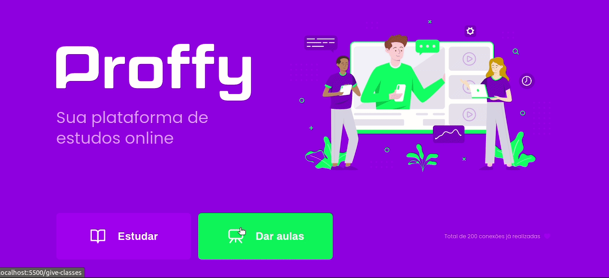

<h1 align="center" style="background : #8257E5; padding-top: 2%" >
    
</h1>

<h1>
    
</h1>
## ✏️ Sobre 

O projeto **Proffy** é uma aplicação que tem a finalidade de conectar professores que queiram lecionar de forma independente e alunos que queiram estudar matérias fundamentais de nivel médio. Esse projeto foi desenvolvido durante o evento **NLW2 (Next Level Week 2) da [RocketSeat](https://rocketseat.com.br/)** 🚀️  com o intuito de ajudar novos devs no inicio de suas carreiras e aperfeiçoar o conhecimento de devs que estejam no mercado através do entendimento prático. 

---

## 👨‍💻️ Tecnologias utilizadas 

O projeto foi desenvolvido utilizando as seguintes tecnologias 
- [JavaScript](https://www.javascript.com/)
- [Nodejs](https://nodejs.org/en/)
- [SQLite](https://www.sqlite.org/index.html)

---

## 📦️ Baixar o projeto 

```bash 
    
    # clonar o repositório
    $ git clone https://github.com/basiliocode/proffy.git

    # Entrar no diretório raiz do projeto
    $ cd proffy

    # Instalar as depências necessárias
    $ npm install

    # Iniciar o projeto (localhost porta 5500)
    $ node src/server.js   
```
---
Desenvolvido por Thiago Basilio no treinamento NLW2 da RocktSeat 🚀️ 